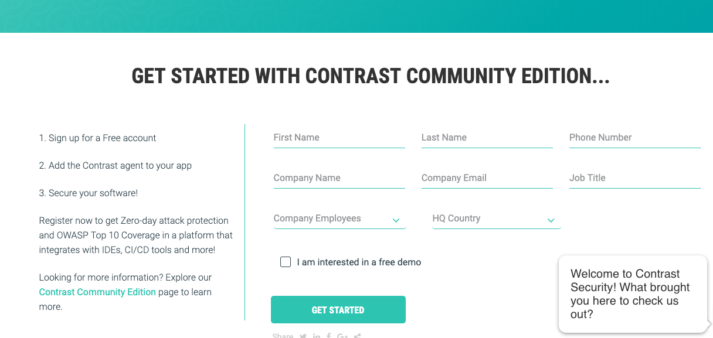
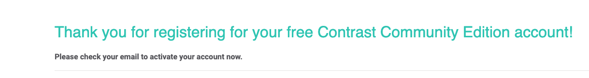
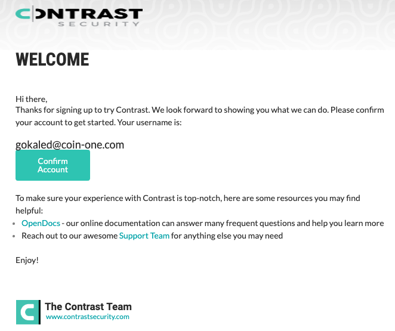
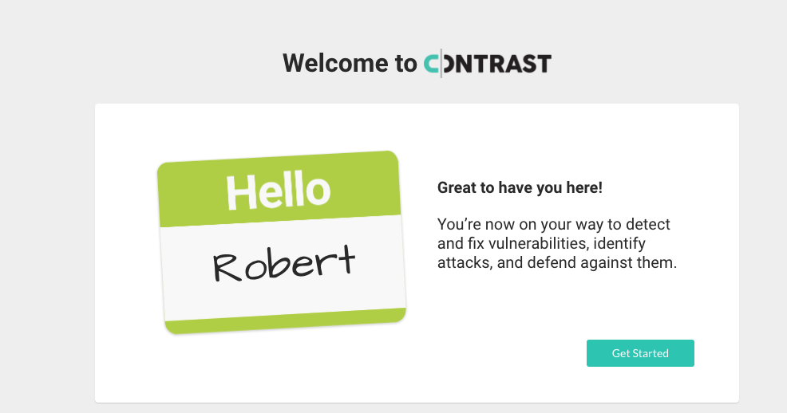
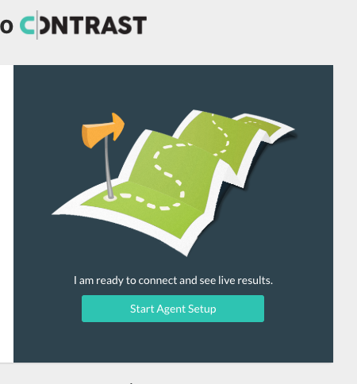
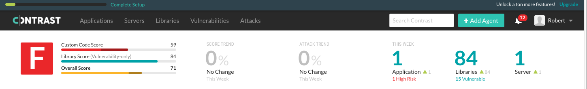
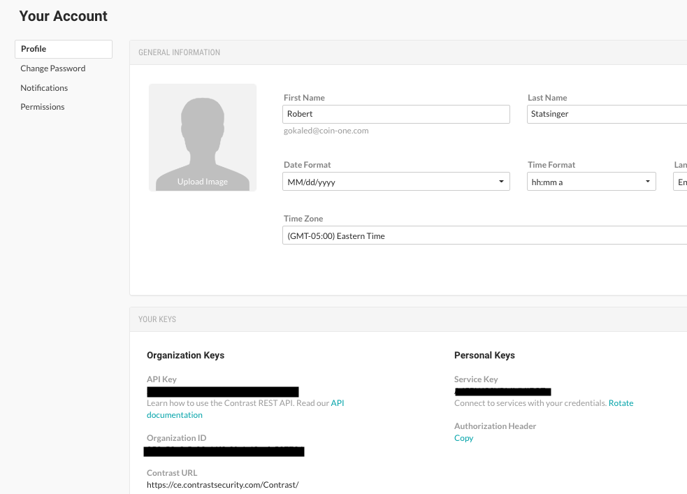
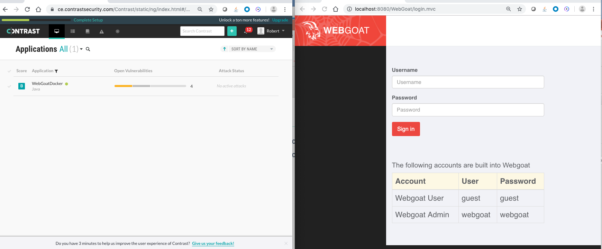
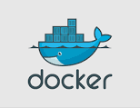
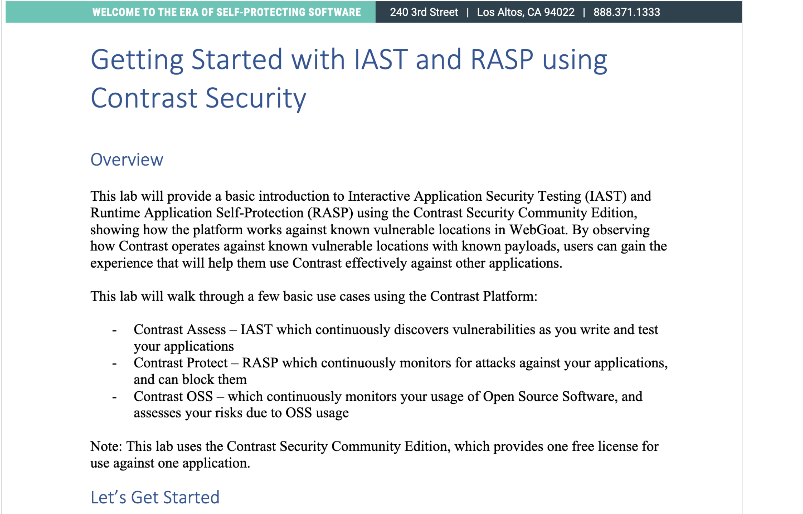

# JUMPSTART DEVSECOPS and SECURITY OBSERVABILITY - for FREE - with the Contrast Community Edition, WebGoat, and Docker

## Got a little Docker experience? This will be easy.

CLONE THIS REPO (or just grab all the files)

SIGN UP FOR A Contrast Community Edition Account [here](https://bit.ly/341PrFu)
	- Check your email for confirmation





CONFIRM YOUR ACCOUNT….

	- Confirm your new account from registration email
	- Click Confirm Account to set your password


GET STARTED…

	- Click Get Started
	- Agree to the Ts & Cs
	- Click Start Agent Setup







	- Click the x at the top right so that you see the main dashboard
	- Click the dropdown next to your name and go to your User Settings page:

GET READY…





Click Profile on the left. Copy the API Key, Service Key, and User Name from the
Profile page to the `./Docker/.env.template` file like so:

```
CONTRAST__API__USER_NAME=<your-user-name>
CONTRAST__API__API_KEY=<your-api-key>
CONTRAST__API__SERVICE_KEY=<your-service-key>
```

Then rename .env.template to .env

GET SET…

GO!

```shell
docker-compose run --rm webgoat
```





## You should be good to go! Next, crack open the [Lab Guide](https://github.com/rstatsinger/IASTRASPLab/blob/master/WebGoatLab.pdf)



