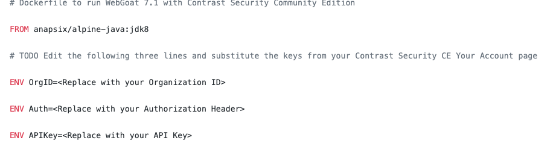

# JUMPSTART DEVSECOPS and SECURITY OBSERVABILITY - for FREE - with the Contrast Community Edition, WebGoat, and Docker

## Got a little Docker experience? This will be easy.

CLONE THIS REPO (or just grab all the files)

	- Create a working directory
	- Stash everything there
	- Make a backup copy of the Dockerfile

SIGN UP FOR A Contrast Community Edition Account [here](https://bit.ly/341PrFu)
	- Check your email for confirmation

CONFIRM YOUR ACCOUNT….

	- Confirm your new account from registration email
	- Click Confirm Account to set your password

GET STARTED…

	- Click Get Started
	- Agree to the Ts & Cs
	- Click Start Agent Setup

	- Click the x at the top right so that you see the main dashboard
	- Click the dropdown next to your name and go to the Your Account page:

GET READY…

	- Plug the Organization ID, Authorization Header, and API Key from the Your Account page into the proper locations in the Dockerfile
  	- Note: this is not best practice but we want to be expedient
	- Doublecheck for correctness!

GET SET…

GO!

% docker build \`pwd\` \-tdockerwebgoat

% docker run \-\-rm –p 8080:8080 –tdockerwebgoat

## You should be good to go! Next, crack open the [Lab Guide](https://github.com/rstatsinger/IASTRASPLab/blob/master/WebGoatLab.pdf)

