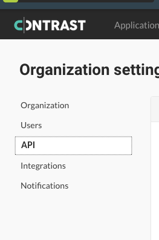

# Security Observability: Hands-On Lab using Contrast Security, Docker, and WebGoat

This lab uses Contrast Security with a deliberately insecure Java application called WebGoat. Contrast injects security instrumentation into applications at runtime, letting you:

- observe and remediate vulnerabilities as they are manifest, in both custom code and libraries
- detect and block attacks

The lab runs WebGoat inside a Docker container, isolating it from your environment.

## Prerequisites

A Contrast Security account, git, and docker (with docker compose)

If you don't have a Contrast Security account, you can sign up for a free one-license Community Edition (CE) account [here](https://bit.ly/341PrFu). 

This lab has been tested for Docker Desktop on Mac - it will probably work on other platforms, too.

## Lab Setup

### Create an Account with Contrast Security

Sign up [here](https://bit.ly/341PrFu) for the Contrast Community Edition if you dont already have a Contrast account. If you are already a Contrast customer or are in an evaluation with us, you can skip ahead to the "Download This Repository" step.

Once you create a new account, you will receive an email with a confirmation link. Make sure you click that link and follow the instructions all the way until you reach the welcome page:


Click "Get Started" to finish creating your account.

Once your account is created you can click "Start Agent Setup" then click the `X` in the upper-right corner to quit the wizard.

### Download This Repository

Clone this repo, or just download the files to your system.

### Copy/Paste Your Contrast Security API Credentials

Open the file called `.env.template` in the lab files and get ready to copy/paste your API credentials from your Contrast Security account. Go to the Contrast Security dashboard online, click on your name (in the upper-right corner), select "Organization" then "API" to find your credentials:



Copy the values for `Agent Username`, `API Key` and `Agent Service Key` into the `.env.template` file. If you are not using the Community Edition, be sure to change the CONTRAST__API__URL to match the URL given in the UI.  Finally, rename the file to `.env`

## Run WebGoat

Open a terminal and go to the lab directory. Run the following command:

```
run.sh
```

You can also run `docker-compose up` directly instead. When the build completes and the container is run, open [http://localhost:8080/WebGoat](http://localhost:8080/WebGoat) in your browser and you're ready!

## Cause Some Trouble!

Now that WebGoat is running you can start to trigger OWASP Top Ten vulnerabilities and attacks. Feel free to play around or follow along in the lab instructions at [Lab-WebGoat.pdf](Lab-WebGoat.pdf).

## View the Results

You can look at the Contrast Security dashboard at any time now and view results under `Applications > WebGoatDocker`

## Questions or Feedback

If you have questions or feedback, please reach out at [rstatsinger@gmail.com](mailto:rstatsinger@gmail.com).
